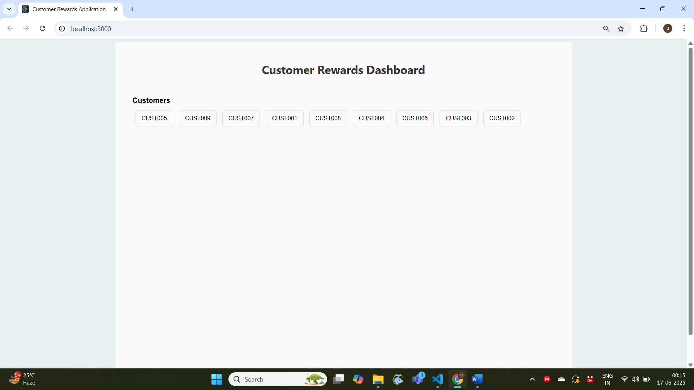
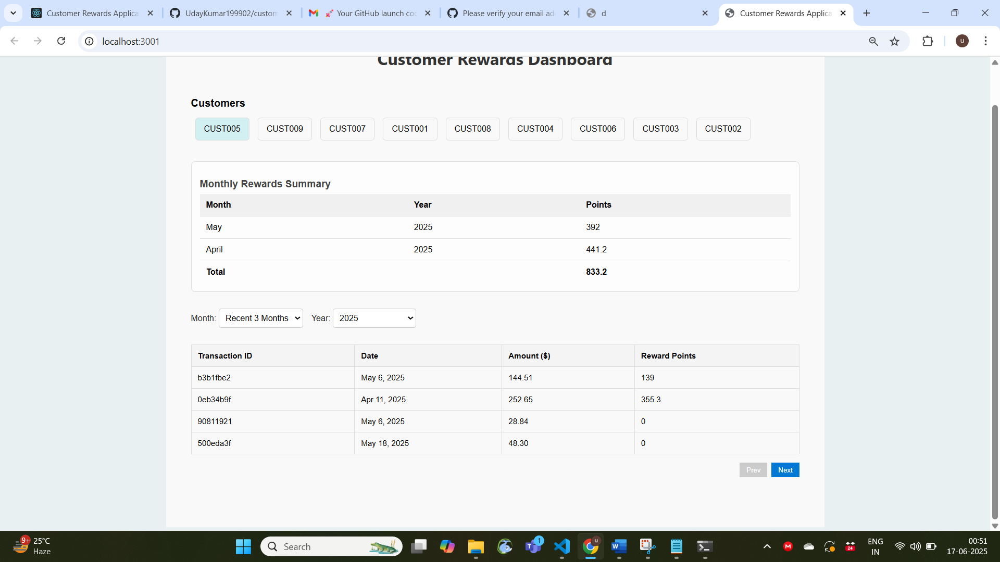
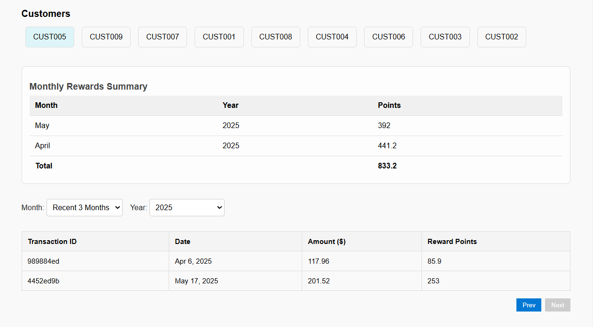
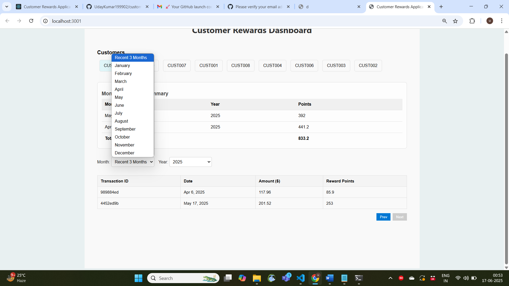
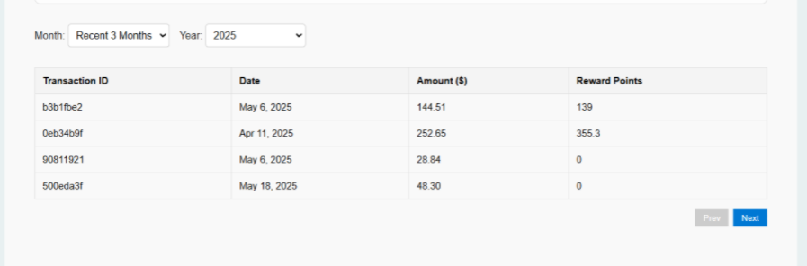
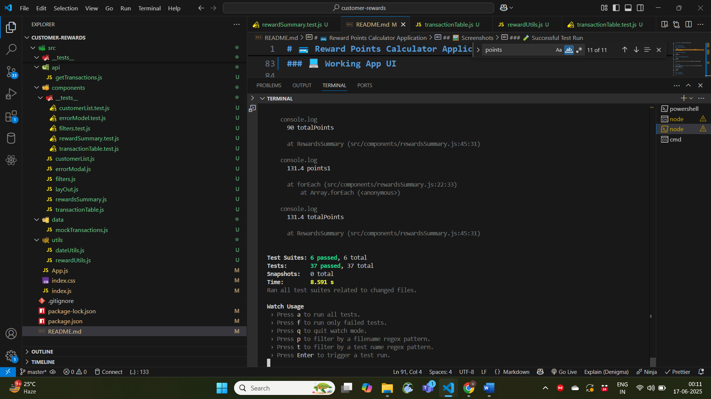

# 💳 Reward Points Calculator Application

The **Reward Points Calculator** is a React-based web application that calculates customer reward points based on their monthly transactions. It simulates a customer loyalty program and includes a user-friendly UI, modular logic, and unit tests for accuracy and reliability.

---

## 📌 Features

- ✅ Calculates reward points for each transaction
- 📆 Groups rewards by month and by customer
- 🔢 Supports floating-point precision in reward totals
- ⚛️ Built using React with styled components
- 🧪 Includes unit tests with Jest and React Testing Library
- 🖼️ Working UI and test screenshots included

---

## 🧮 Reward Calculation Logic

The reward rules are:

- **No points** for purchases ≤ $50
- **1 point per dollar** for amounts between $50 and $100
- **2 points per dollar** for amounts over $100
- Points are calculated with decimal precision

### Example:

| Transaction Amount | Points Calculation                           | Points |
| ------------------ | -------------------------------------------- | ------ |
| $40                | Below $50                                    | 0      |
| $75                | (75 - 50) × 1                                | 25     |
| $120               | 50 (from $50–$100) + (20 × 2) = 90           | 90     |
| $140.7             | 50 + ((140.7 - 100) × 2) = 50 + 81.4 = 131.4 | 131.4  |

---

## 🛠️ Technologies Used

- **Frontend**: React JS (with functional components)
- **Styling**: Styled Components
- **Testing**: Jest, React Testing Library

---

## 🚀 Getting Started

### 1. Clone the Repository

```bash
git clone https://github.com/UdayKumar199902/ui-customer-rewards.git
cd ui-customer-rewards
```

### 2. Install Dependencies

```bash
npm install
```

### 3. Start the Development Server

```bash
npm start
```

Your app will run on: [http://localhost:3000](http://localhost:3000)

---

## 🧪 Testing

I use **Jest** and **React Testing Library** to test reward calculation and UI components.

### ▶️ Run All Tests

```bash
npm test
```

## 🖼️ Screenshots

### 💻 Working App UI

1. Open the app in your browser at [http://localhost:3000](http://localhost:3000)
2. When opening the app it will take 1.5sec to fetch customer data.
   

3. After loading you can see the list of customers with their IDs;
   
4. Click on a customer to view their monthly transactions and reward points. You can also see the total reward points for each month;
   
5. Each transaction shows the amount, date, and calculated reward points;
   

6. We can filter based on month and year, then transaction for that month will be shown;
   
7. Pagination is implemented to handle large datasets, allowing users to navigate through pages of transactions;by clicking next and previous buttons you can navigate through pages.
   
8. If no transactions available for particular month, it will show a message;
   
9. 
